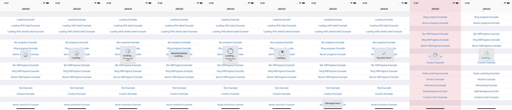
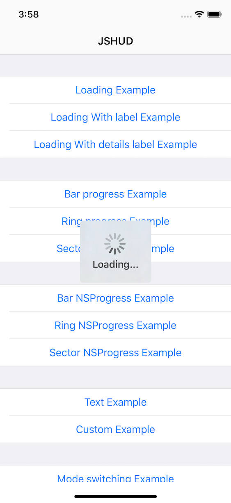
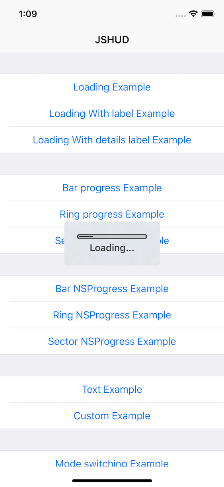
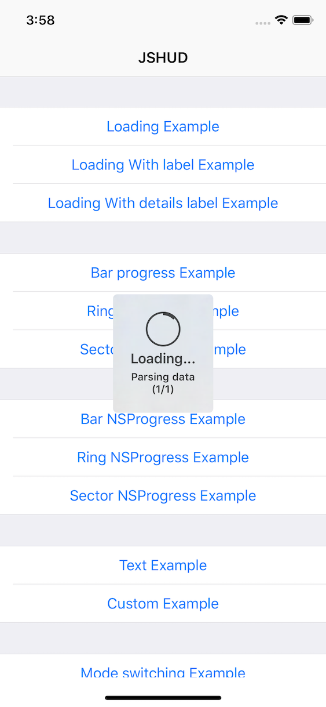
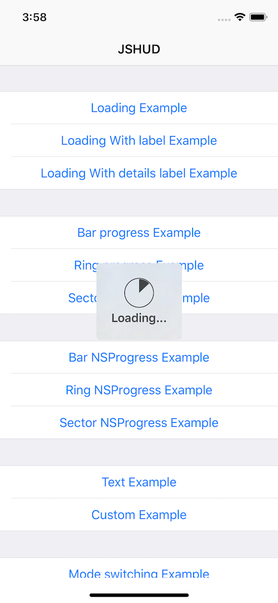
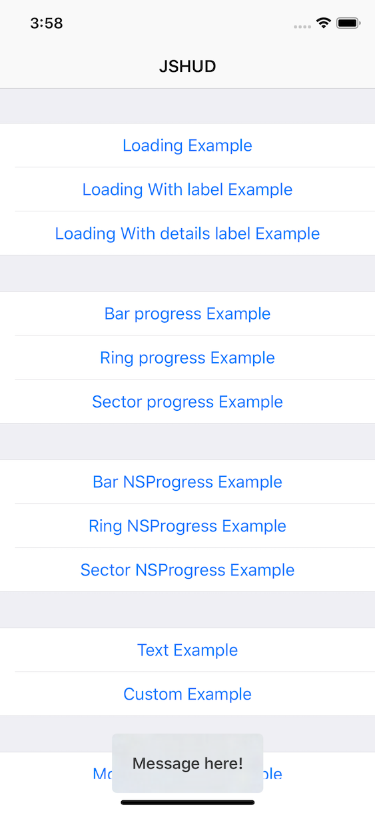
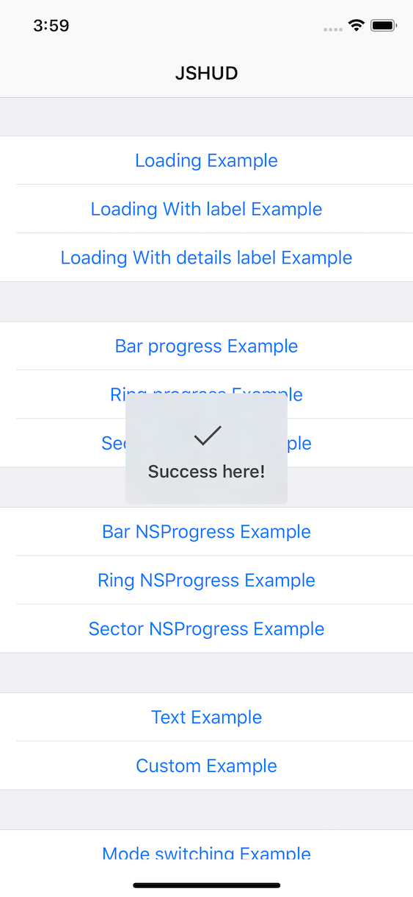
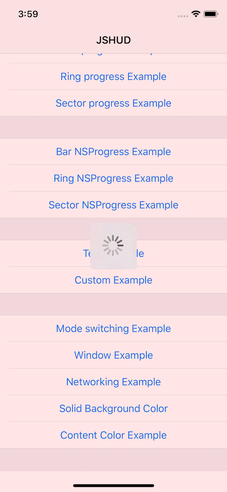

# JSHUD

<p align="center">
<a href="https://github.com/apple/swift"></a>
<a href="https://github.com/apple/swift"></a>
<a href="https://github.com/spirit-jsb/JSHUD/"></a>
<a href="https://github.com/spirit-jsb/JSHUD/blob/master/LICENSE"></a>
<a href="https://cocoapods.org/pods/JSHUD"></a>
</p>



## 示例代码

如需要运行示例项目，请 `clone` 当前 `repo` 到本地，并且从根目录下执行 `JSHUD.xcworkspace`，打开项目后切换 `Scheme` 至 `JSHUD-Demo` 即可。

## JSHUD 使用方法

### Loading Example


```swift
let hud = JSHUD.showHUD(addTo: self.navigationController!.view, animated: true)
DispatchQueue.global().async {
    self.doSomeWork()
    DispatchQueue.main.async {
    hud.hideAnimated(true)
    }
}
```

### Loading With label Example



```swift
let hud = JSHUD.showHUD(addTo: self.navigationController!.view, animated: true)
hud.label.text = "Loading..."
DispatchQueue.global().async {
    self.doSomeWork()
    DispatchQueue.main.async {
        hud.hideAnimated(true)
    }
}
```

### Loading With details label Example


```swift
let hud = JSHUD.showHUD(addTo: self.navigationController!.view, animated: true)
hud.label.text = "Loading..."
hud.detailsLabel.text = "Parsing data\n(1/1)"
DispatchQueue.global().async {
    self.doSomeWork()
    DispatchQueue.main.async {
        hud.hideAnimated(true)
    }
}
```

### Bar progress Example



```swift
let hud = JSHUD.showHUD(addTo: self.navigationController!.view, animated: true)
hud.mode = .barProgress
hud.label.text = "Loading..."
DispatchQueue.global().async {
    self.doSomeWorkWithProgress()
    DispatchQueue.main.async {
        hud.hideAnimated(true)
    }
}
```

### Ring progress Example



```swift
let hud = JSHUD.showHUD(addTo: self.navigationController!.view, animated: true)
hud.mode = .ringProgress
hud.label.text = "Loading..."
hud.detailsLabel.text = "Parsing data\n(1/1)"
DispatchQueue.global().async {
    self.doSomeWorkWithProgress()
    DispatchQueue.main.async {
        hud.hideAnimated(true)
    }
}
```

### Sector progress Example



```swift
let hud = JSHUD.showHUD(addTo: self.navigationController!.view, animated: true)
hud.mode = .sectorProgress
hud.label.text = "Loading..."
DispatchQueue.global().async {
    self.doSomeWorkWithProgress()
    DispatchQueue.main.async {
        hud.hideAnimated(true)
    }
}
```

### Text Example



```swift
let hud = JSHUD.showHUD(addTo: self.navigationController!.view, animated: true)
hud.mode = .text
hud.label.text = "Message here!"

hud.offset = CGPoint(x: 0.0, y: JSHUD.JSProgressMaxOffset)

hud.hideAnimated(true, afterDelay: 3.0)
```

### Custom Example



```swift
let hud = JSHUD.showHUD(addTo: self.navigationController!.view, animated: true)
hud.mode = .custom
hud.label.text = "Success here!"

let image = UIImage(named: "icon_check")?.withRenderingMode(.alwaysTemplate)
hud.customView = UIImageView(image: image)

hud.hideAnimated(true, afterDelay: 3.0)
```

### Solid Background Color Example



```swift
let hud = JSHUD.showHUD(addTo: self.navigationController!.view, animated: true)

hud.backgroundView.backgroundStyle = .solidColor
hud.backgroundView.color = UIColor.red.withAlphaComponent(0.1)

DispatchQueue.global().async {
    self.doSomeWork()
    DispatchQueue.main.async {
        hud.hideAnimated(true)
    }
}
```

### Content Color Example


```swift
let hud = JSHUD.showHUD(addTo: self.navigationController!.view, animated: true)
hud.contentColor = UIColor(red: 0.0, green: 0.6, blue: 0.7, alpha: 1.0)

hud.label.text = "Loading..."

DispatchQueue.global().async {
    self.doSomeWork()
    DispatchQueue.main.async {
        hud.hideAnimated(true)
    }
}
```

此外还有 `HUD` 的组合操作，具体代码请参考 `JSHUD-Demo` 中的示例。

## 注意事项

⚠️ **请确保 `JSHUD` 是在主线程执行的，否则会抛出异常信息！** ⚠️

## Swift 版本依赖
| Swift | JSHUD       |
| ------| ------------|
| 4.0   | 1.0.0~1.0.1 |
| 4.2   | >= 1.1.0    |

## 限制条件
* **iOS 9.0** and Up
* **Xcode 10.0** and Up
* **Swift Version = 4.2**

## 安装

`JSHUD` 可以通过 [CocoaPods](https://cocoapods.org) 获得。安装只需要在你项目的 `Podfile` 中添加如下字段：

```ruby
pod 'JSHUD', '~> 1.1.0'
```

## 作者

spirit-jsb, sibo_jian_29903549@163.com

## 许可文件

`JSHUD` 可在 `MIT` 许可下使用，更多详情请参阅许可文件。
